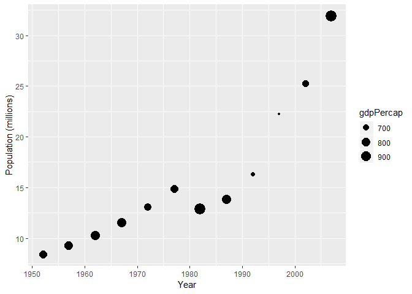

hw03-gapminder
================
kioke
September 29, 2018

Tasks
=====

Pick three of the tasks and present a table and a figure for each.

### How is life expectancy changing over time on different continents?

The figure below shows life expectancy over time, separated by continent by the colour of the points.

``` r
gapminder %>% 
  ggplot(aes(year,lifeExp,colour=continent)) +
  geom_jitter(alpha=0.33) +
  labs(x = "Year", y = "Life Expectancy") #To change the axis labels
```


We could also choose to represent the different continents on different plots by facetting the data, if the above figure is too visually busy to read. The figure below separates the data by continent into different plots.

``` r
gapminder %>% 
  ggplot(aes(year,lifeExp)) +
  geom_jitter(alpha=0.2) +
  facet_wrap( ~ continent) +
  labs(x = "Year", y = "Life Expectancy")
```


Below is a table summarizing the above figures globally.

``` r
gapminder %>% 
  group_by(year) %>% 
  summarize(mean_life_exp = mean(lifeExp)) %>% 
  knitr::kable()
```

|  year|  mean\_life\_exp|
|-----:|----------------:|
|  1952|         49.05762|
|  1957|         51.50740|
|  1962|         53.60925|
|  1967|         55.67829|
|  1972|         57.64739|
|  1977|         59.57016|
|  1982|         61.53320|
|  1987|         63.21261|
|  1992|         64.16034|
|  1997|         65.01468|
|  2002|         65.69492|
|  2007|         67.00742|

We can also look at how the means change over time in a table with continents as another variable.

``` r
gapminder %>% 
  group_by(year,continent) %>% 
  summarize(mean_life_exp = mean(lifeExp)) %>% 
  knitr::kable()
```

|  year| continent |  mean\_life\_exp|
|-----:|:----------|----------------:|
|  1952| Africa    |         39.13550|
|  1952| Americas  |         53.27984|
|  1952| Asia      |         46.31439|
|  1952| Europe    |         64.40850|
|  1952| Oceania   |         69.25500|
|  1957| Africa    |         41.26635|
|  1957| Americas  |         55.96028|
|  1957| Asia      |         49.31854|
|  1957| Europe    |         66.70307|
|  1957| Oceania   |         70.29500|
|  1962| Africa    |         43.31944|
|  1962| Americas  |         58.39876|
|  1962| Asia      |         51.56322|
|  1962| Europe    |         68.53923|
|  1962| Oceania   |         71.08500|
|  1967| Africa    |         45.33454|
|  1967| Americas  |         60.41092|
|  1967| Asia      |         54.66364|
|  1967| Europe    |         69.73760|
|  1967| Oceania   |         71.31000|
|  1972| Africa    |         47.45094|
|  1972| Americas  |         62.39492|
|  1972| Asia      |         57.31927|
|  1972| Europe    |         70.77503|
|  1972| Oceania   |         71.91000|
|  1977| Africa    |         49.58042|
|  1977| Americas  |         64.39156|
|  1977| Asia      |         59.61056|
|  1977| Europe    |         71.93777|
|  1977| Oceania   |         72.85500|
|  1982| Africa    |         51.59287|
|  1982| Americas  |         66.22884|
|  1982| Asia      |         62.61794|
|  1982| Europe    |         72.80640|
|  1982| Oceania   |         74.29000|
|  1987| Africa    |         53.34479|
|  1987| Americas  |         68.09072|
|  1987| Asia      |         64.85118|
|  1987| Europe    |         73.64217|
|  1987| Oceania   |         75.32000|
|  1992| Africa    |         53.62958|
|  1992| Americas  |         69.56836|
|  1992| Asia      |         66.53721|
|  1992| Europe    |         74.44010|
|  1992| Oceania   |         76.94500|
|  1997| Africa    |         53.59827|
|  1997| Americas  |         71.15048|
|  1997| Asia      |         68.02052|
|  1997| Europe    |         75.50517|
|  1997| Oceania   |         78.19000|
|  2002| Africa    |         53.32523|
|  2002| Americas  |         72.42204|
|  2002| Asia      |         69.23388|
|  2002| Europe    |         76.70060|
|  2002| Oceania   |         79.74000|
|  2007| Africa    |         54.80604|
|  2007| Americas  |         73.60812|
|  2007| Asia      |         70.72848|
|  2007| Europe    |         77.64860|
|  2007| Oceania   |         80.71950|

### Mean Life Expectancy, 1982-1997

In order to compute the mean of any data between 1982 and 1997, we first need to filter out other years

``` r
mill <- gapminder %>% 
  filter(year >= 1982 & year <= 1997)
```

Now to determine the mean life expectancy of those years.

``` r
mill %>% 
  group_by(continent) %>% 
  summarize(mean_mill_life_exp = mean(lifeExp)) %>% 
  knitr::kable()
```

| continent |  mean\_mill\_life\_exp|
|:----------|----------------------:|
| Africa    |               53.04138|
| Americas  |               68.75960|
| Asia      |               65.50671|
| Europe    |               74.09846|
| Oceania   |               76.18625|

``` r
mill %>% 
  ggplot(aes(gdpPercap, lifeExp)) +
  geom_point() + 
  scale_x_log10()
```


``` r
mill %>% 
  group_by(continent) %>% 
  summarize(mean_mill_life_exp = mean(lifeExp)) %>% 
  ggplot(aes(continent, mean_mill_life_exp)) +
  geom_point(size = 3) +
  labs(x = "Continent", y = "Mean Life Expectancy 1982-1997")
```


